```{r setup, include=FALSE,echo = F, message = F, warning = F, tidy = F}
# make this an external chunk that can be included in any file
options(width = 100,digits=4)
opts_chunk$set(message = FALSE, fig.align = "center", warning = FALSE, comment = NA, dpi = 100, tidy = FALSE, fig.width=8,fig.height=5,cache = FALSE)

options(xtable.type = 'html')
knit_hooks$set(inline = function(x) {
  if(is.numeric(x)) {
    round(x, getOption('digits'))
  } else {
    paste(as.character(x), collapse = ', ')
  }
})
knit_hooks$set(plot = knitr:::hook_plot_html)

```

<style>

.title-slide {
  background-color: #e2e2e2;
}

.title-slide hgroup > h1{
  font-family: 'Oswald', sans-serif;
  color: #202020;
}

.title-slide hgroup > h2{
  font-family: 'Signika Negative', 'Calibri', sans-serif;
  color: #202020;
}


strong{
 color: #4876FF;
}
</style>

## REmap
### 重新定义你的地图
<small> Created by [Chiffon](http://chiffon.gitcafe.io)郎大为</small><br/>
<small>Supstat. Inc 数据科学家</small>
<script src="./libraries/jquery.min.js"></script>
<script>
			document.write( '<link rel="stylesheet" href="libraries/frameworks/revealjs/css/print/' + ( window.location.search.match( /print-pdf/gi ) ? 'pdf' : 'paper' ) + '.css" type="text/css" media="print">' );
		</script>

--- &vertical 
## 地理信息的可视化
- 目的:
  - 认识数据
  - 展示数据

- 相关工具
  - 商务工具: Tableau(Excel)
  - GIS工具: ArcGIS
  - 前端工具: Echarts.js D3.js,...

***
## 相关的R包
- 静态地理信息:
  + `maps`
  + `ggmap`
  + `choroplethr`
- 交互地理信息: 
  + `leaflet`
  + `googleVis`
- 辅助的R包:
  + `RgoogleMaps`, `mapdata`, `mapproj`, `baidumap`,...


***
## 静态化地图
- `maps`
- 最早的一批地理信息可视化
- US, world, china,...

```{r eval=F}
library(maps)
library(mapdata)
data("chinaMapEnv")
map('china')
```

***
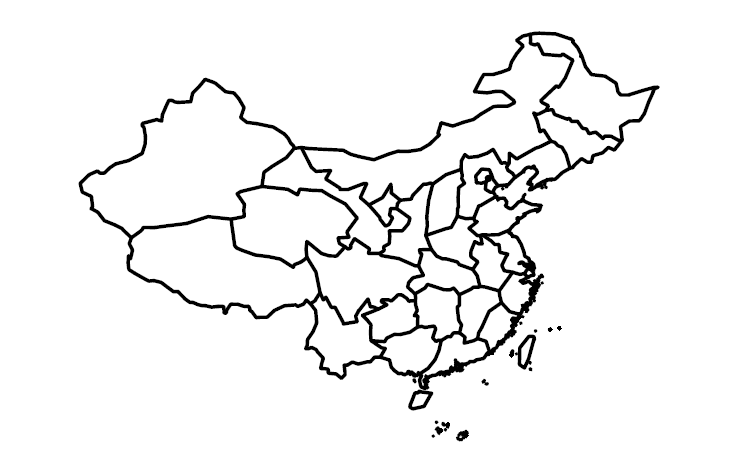


***
## 静态化地图
- `choroplethr`
- 海外很火的R包


***
```{r eval=F}
library(choroplethr)
library(choroplethrMaps)
data(df_pop_country)
country_choropleth(df_pop_country,
                   title      = "2012 Population Estimates",
                   legend     = "Population",
                   num_colors = 1,
                   zoom       = c("china", "japan", 
                                  "north korea","south korea"))
```


***
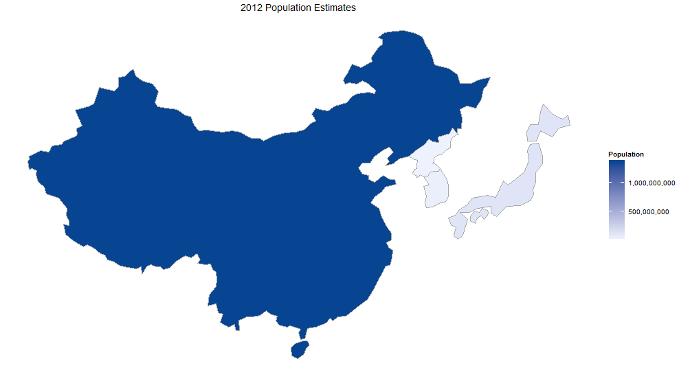


***
## 实时静态地图

- `ggmap`

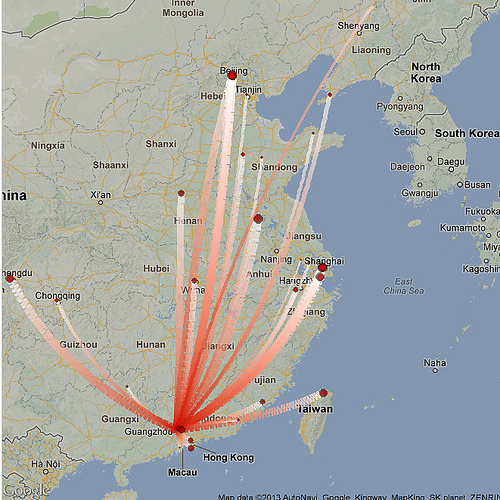
<small>http://cos.name/2013/06/weibo-fans-map-visualization/</small>


***
## 实时静态地图
- Sorry google

<small>http://nicpic.com</small>


***
## 实时静态地图
- HI baidu
- 与ggplot2结合
- 数据获取
```{r eval=F}
devtools::install.github("badbye/baidumap")
```


***

```{r eval=F}
library(baidumap)
p <- getBaiduMap('南昌') # the same
ggmap(p)+ geom_point(aes(x=115.9,y=28.7),size = 3,color='red')
```


***
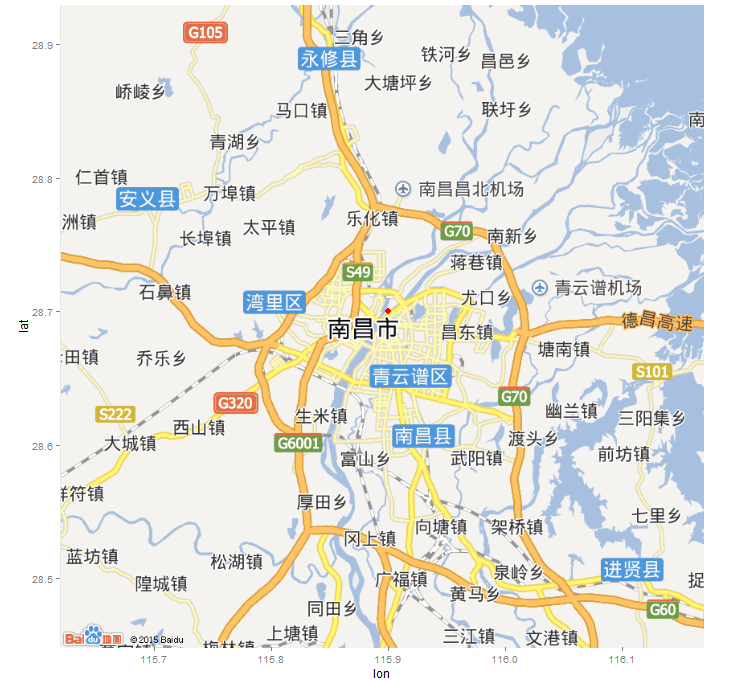


***
## 可交互地图
- `leaflet`
- `recharts`

```{r eval=F}
library(leaflet)
m = leaflet() %>% addTiles()
m = m %>% setView(115.86453, 28.68767, zoom = 17)
```

***


--- &vertical ds:soothe
## REmap

- REmap是一个基于[Echarts](http://echarts.baidu.com) 的R包.

- 提供一个简便,可交互的地图数据可视化工具.目前托管在[github](https://github.com/lchiffon/REmap)

```{r eval = F}
devtools::install_github('lchiffon/REmap')
library(REmap)
```

***
>- 动态可交互地图
>- 代码友好
>- 解决常用的地图需求
>- 期待更多的人接触Echarts

***
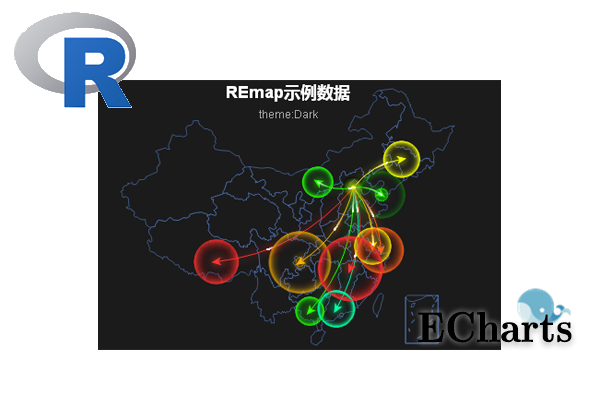


***
## 基本原理
>- 使用R处理传入的数据
>- 写出Javascript脚本(Echarts)
>- 保存在临时的html文件中
>- 调用浏览器展示


***
### 不需要的
>- 不需要懂html
- 不需要懂Javascript/Echarts

### 需要的
>- R
- Chorme或者Firefox作为默认浏览器
- UTF-8编码的数据框

---


<a href="./html/remap.html"  target="_blank"> <huge>remap(demoC)</huge></a>


--- &vertical ds:soothe
## 分级统计图
- 使用颜色的深浅来展示数据
- 应用最广泛的地理位置可视化之一


***
省份 | GDP(亿元)
---|---
北京 | 10578.28
天津 | 7884.04
河北 | 13798.13
上海 | 11887
... | ...

<small>数据来源: 中国统计年鉴2015年第二季度GDP</small>

***
```{r eval= F}
library(REmap)
GDP = read.csv("data/GDP.csv",encoding = "UTF-8")
remapC(GDP,
		 color = c("red","yellow"),
		 title = "2015年第二季度中国各省份GDP(亿元)",
		 subtitle = "数据来源中国统计年鉴")
```


***
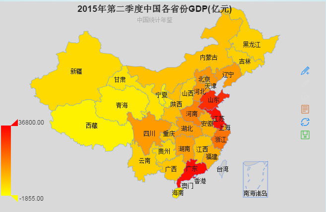

<a href="./html/1GDP.html"  target="_blank">Link</a>


***
city | space | population
---|---|---
南昌市 | 7402.36 | 504.3
九江市 | 18823 | 485
上饶市 | 22791 | 740
抚州市 | 18817 | 400
... | ... | ...


<small>数据来源: http://baike.baidu.com</small>

***
```{r eval = F}
popu = read.csv("data/jiangxi.csv",encoding = "UTF-8")
plotdata = data.frame(city = popu$city,
							 density = popu$population/popu$space*1e4)
remapC(data = plotdata,maptype = "江西",
		 title = "江西人口密度(人/平方公里)")

```

***
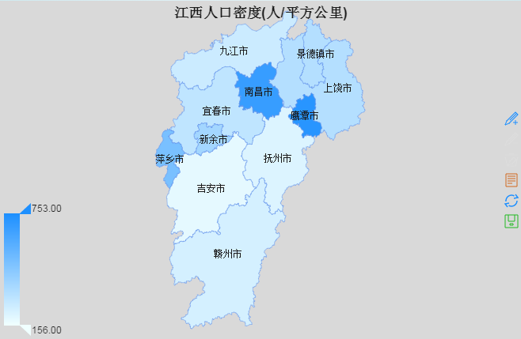

<a href="./html/2Jiangxi.html"  target="_blank">Link</a>


--- &vertical ds:soothe
## Bmap


***
出发点 | 到达点
---|---
北京 | 上海
北京 | 广州
北京 | 大连
北京 | 南宁
... | ...


***
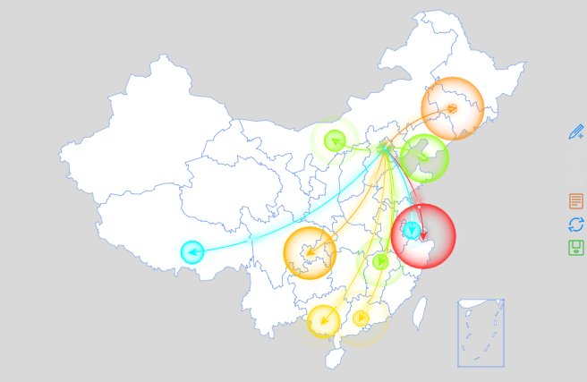

remap(demoC,theme = get_theme("Bright"))

<a href="./html/3remap.html"  target="_blank">Link</a>


***
```{r eval = F}
remapB(markLineData = demoC,
		 markPointData = demoC[,2])

# remapB(markLineData = demoC,
# 		 markPointData = demoC[,2],color = "Blue")
```


***


<a href="./html/4bmap.html"  target="_blank">link</a>


***
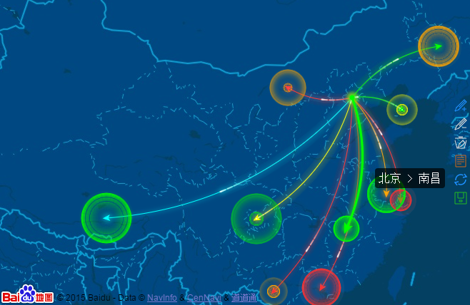

<a href="./html/4bmap2.html"  target="_blank">link</a>


--- &vertical ds:soothe
## Bmap
### 城市级地图

***
```{r eval=F}
## 获取线路
library(baidumap)
df = getRoute('南昌西站', '江西财经大学北区',region="南昌")
## 准备数据
df$label = paste("Point",1:dim(df)[1])
markLinedata = data.frame(origin = df$label[-dim(df)[1]],
								  destination = df$label[-1])
## 绘制地图
remapB(center = get_city_coord("南昌"),
		 zoom = 13,
		 markLineData = markLinedata,geoData = df,
		 markLineTheme = markLineControl(smoothness = 0,
		 										  effect = T,
		 										  symbolSize = c(0,0)))
```


***


<a href="./html/5route.html"  target="_blank">link</a>

***

```{r eval=F}
## 获取数据
barbeque = getPlace('烧烤', '南昌')
## 准备数据
barbeque$tooltip = paste(barbeque$name,
								 barbeque$address,
								 barbeque$telephone,sep = "<br/>")
geodata = data.frame(barbeque$lon,
							barbeque$lat,
							barbeque$name)
## 绘制数据
remapB(center = get_city_coord("江西财经大学北区"),
		 zoom = 15,
		 markPointData = barbeque,
		 geoData = geodata,
		 markPointTheme = markPointControl(effect = F,symbol = "pin",
		 											 symbolSize = 7,
		 											 color="red"),
		 title="南昌烧烤分布")
```


***
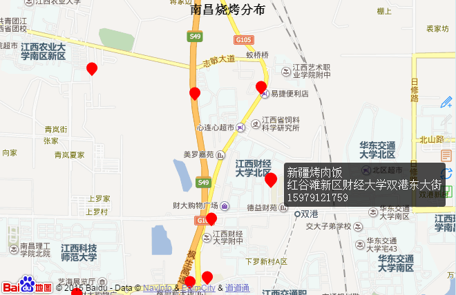

<a href="./html/6barbeque.html"  target="_blank">link</a>


--- &vertical ds:soothe
## 2015中国R语言会议


***
place | name | time 
---|---|---
西安|2015数据与价值欧亚论坛暨R会议西安分论坛 | 2015年4月18日 
广州 | 中国R语言（广州）会议-暨华南地区数据科学会议 | 2015年5月23-24日 
北京 | 第八届中国R语言会议（北京）  | 2015年6月6-7日 
... | ... | ... | ...


<small>数据来源: http://cos.name</small>

***
```{r eval = F}
## 读取数据
rCon = read.csv("data/R-con.csv",encoding = "UTF-8")
## 准备数据
rCon$pic = paste0("")
plotdata = data.frame(place = rCon$place,
							 symbol = "image://./pic/cos.png",
							 tooltip = paste(rCon$name,rCon$time,rCon$pic,sep = "<br/>"))
## 绘制地图
remapC(data = chinaIphone,
		 color = c("white","white"),
		 markPointData = plotdata,
		 markPointTheme = markPointControl(effect = F,
		 											 symbolSize = 30),
		 title = "2015中国R语言会议"
		 )
```


***


<a href="./html/7COS.html"  target="_blank">link</a>


--- &vertical ds:soothe
## 最早的数据产品


***
## 什么算一个数据产品
- 数据驱动
- 建模预测
- 较好的可视化来展示结果

***
## 天气预报
>- 数据驱动
>- 建模预测
>- 较好的可视化来展示结果
>- 如果能更准确点...

***
```{r eval =F}
cityvec = c("上海",
            "广州","大连","南宁","南昌","拉萨","长春","包头",
            "重庆","武汉","北京","洛阳","台北","乌鲁木齐","沈阳",
            "西安","成都","合肥","长沙","济南","福州","兰州")
weather = sapply(cityvec,get_weather_str)
plotdata = data.frame(cityvec,
                      tooltip=paste0(cityvec,weather[1,]),
                      symbol = weather[2,])
remapB(markPointData = plotdata,
       markPointTheme = markPointControl(symbolSize = 25,
                                         effect = F),
       color = "Blue",
       title = "未来天气预报",
       subtitle = "by REmap, Chiffon")
```


***


<a href="./html/8weather.html"  target="_blank">link</a>


--- &vertical ds:soothe
## 美好的未来

***
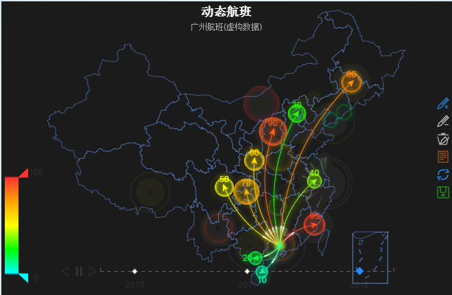

<a href="./html/demo1.html"  target="_blank">link</a>


***


<a href="./html/demo2.html" target="_blank">link</a>


---
## [七风阁](http://lchiffon.github.com/)


---
## [REmap主页](http://lchiffon.github.com/REmap)

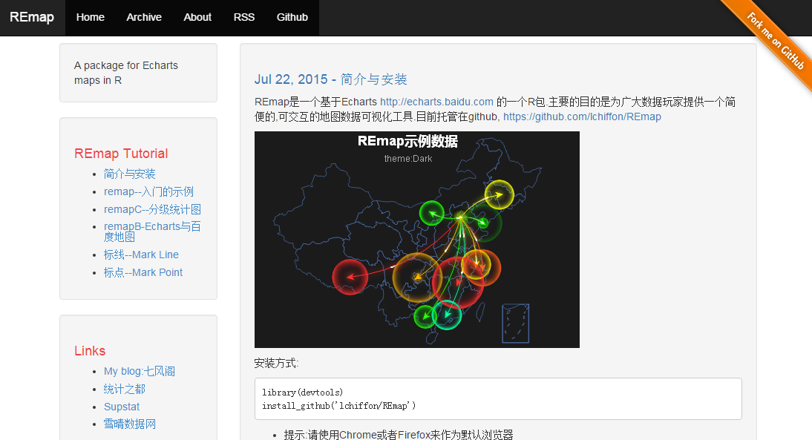

---

## [雪晴网](http://xueqing.cc)


---
## Thanks


---
## Q&A
- 微博@郎大为Chiffon

[REmap主页](http://lchiffon.github.com/REmap)
[My Blog: 七风阁](http://lchiffon.github.io)
<script>
$('ul.incremental li').addClass('fragment')
</script>